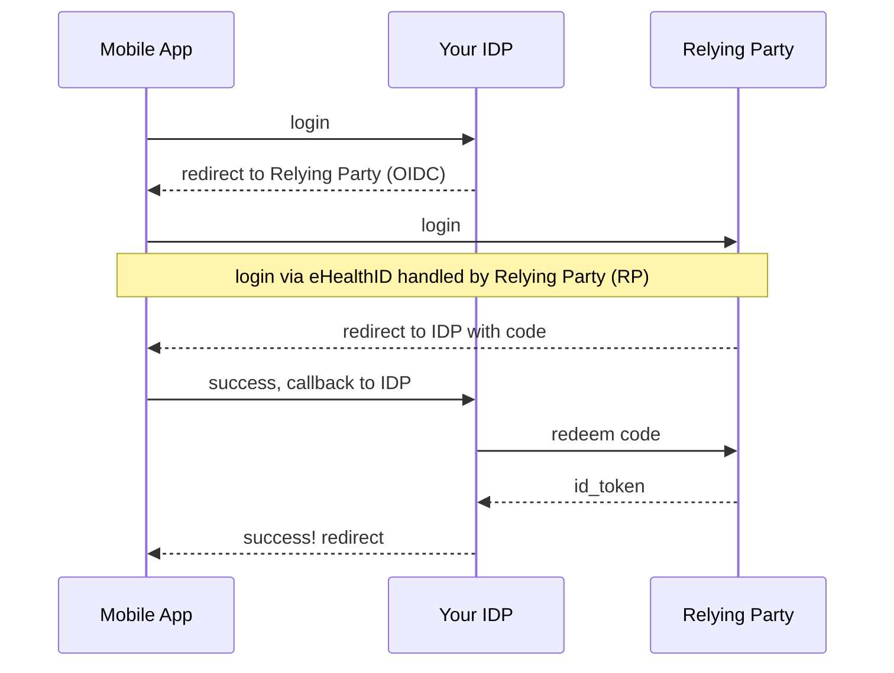
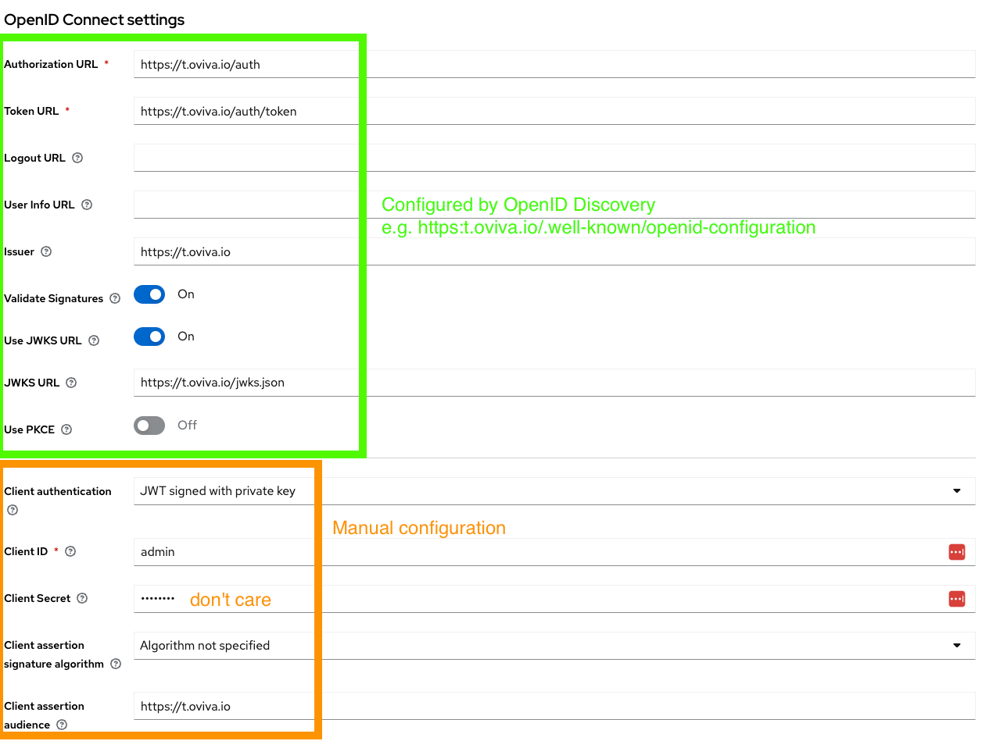
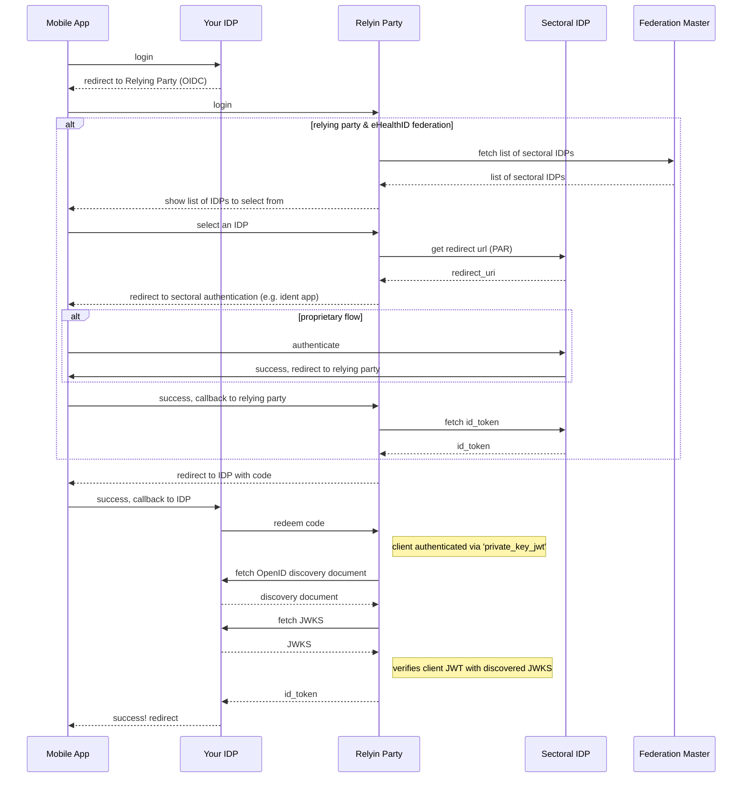

[](https://sonarcloud.io/summary/new_code?id=oviva-ag_ehealthid-relying-party)
[](https://sonarcloud.io/summary/new_code?id=oviva-ag_ehealthid-relying-party)

# OpenID Connect Relying Party for GesundheitsID (eHealthID)

The goal is to provide a simple standalone server exposing Germany's 'GesundheitsID' (eHealthID) as
a good old OpenID Connect Relying Party (OIDC RP).

Identity Providers such as Keycloak can link accounts with OIDC out-of-the-box

## Authentication Flow IDP / Relying Party



## Contents

- [ehealthid-rp](./ehealthid-rp) - A standalone application to act as a OpenID Connect (OIDC)
  Relying Party. Bridges OIDC and Germany's GesundheitsID OpenID federation.
- [esgen](./esgen) - A script to generate keys and federation registration forms.
- [ehealthid](./ehealthid) - A plain Java library to build RelyingParties for GesundheitsID.
    - API clients
    - Models for the EntityStatments, IDP list endpoints etc.
    - Narrow support for the 'Fachdienst' use-case.

## Limitations

- for now sessions are stored in-memory, this implies:
    - rebooting the server will force users currently logging-in to restart
    - if multiple instances run, sessions must be sticky (e.g. use `session_id` cookie)
    - though it would be relatively straight forward to use a database instead
- this is tested in the 'Testumgebung' (TU) against the Gematik IDP due to a lack of other options

# Quickstart

```shell

#---- 1. generate keys
# the URI where your relying-party will run, 
# for the registration this _MUST_ be publicly reachable
export ISSUER_URI=https://mydiga.example.com

# generate keys for the application, keep those safe and secure
./cli.sh keygen

#---- 2. deploy the relying party
docker run --rm \
    -v "$(pwd)"/enc_jwks.json:/secrets/enc_jwks.json:ro \
    -v "$(pwd)"/sig_jwks.json:/secrets/sig_jwks.json:ro \
    -e "EHEALTHID_RP_APP_NAME=Awesome DiGA" \
    -e "EHEALTHID_RP_BASE_URI=$ISSUER_URI" \
    -e 'EHEALTHID_RP_FEDERATION_ENC_JWKS_PATH=/secrets/enc_jwks.json' \
    -e 'EHEALTHID_RP_FEDERATION_SIG_JWKS_PATH=/secrets/sig_jwks.json' \
    -e 'EHEALTHID_RP_FEDERATION_MASTER=https://app-test.federationmaster.de' \
    -e 'EHEALTHID_RP_REDIRECT_URIS=https://sso-mydiga.example.com/auth/callback' \
    -e 'EHEALTHID_RP_ES_TTL=PT5M' \
    -e 'EHEALTHID_RP_IDP_DISCOVERY_URI=https://sso-mydiga.example.com/.well-known/openid-configuration' \
    ghcr.io/oviva-ag/ehealthid-relying-party:latest

#---- 3. register with the federation master

# a string received from Gematik as part of the registration process
# see: https://wiki.gematik.de/pages/viewpage.action?pageId=544316583
export MEMBER_ID=FDmyDiGa0112TU

# generate the registration XML and send it to gematik
./cli.sh \
    --environment=TU \
    --issuer-uri=$ISSUER_URI \
    --member-id="$MEMBER_ID"
    
# afterwards the XML for registration in the federation can be found below, send it
# as an email attachment to Gematik 
# see: https://wiki.gematik.de/pages/viewpage.action?pageId=544316583
cat federation_registration_form.xml
```

**IMPORTANT:**

- The relying party __MUST__
  be [registered within the OpenID federation](https://wiki.gematik.de/pages/viewpage.action?pageId=544316583)
  to work fully.
- In order to register for the federation, your entity statment __MUST__ be publicly available.

Once the server is booted, it will:

1. Expose an OpenID Discovery document at `$EHEALTHID_RP_BASE_URI/.well-known/openid-configuration`
   ```shell
    curl $BASE_URI/.well-known/openid-configuration | jq .
    ```

2. Expose an OpenID Federation entity configuration
   at `$EHEALTHID_RP_BASE_URI/.well-known/openid-federation`
   ```shell
    curl $BASE_URI/.well-known/openid-federation | jwt decode -j - | jq .payload
    ```

3. Be ready to handle OpenID Connect flows and handle them via Germany's GesundheitsID federation.

## Configure Identity Provider

Generic settings:

- the relying party OpenID configuration is at `$ISSUER_URI/.well-known/openid-configuration`
    - token_url: `/auth/token`
    - auth_url: `/auth`
    - jwks_url: `/jwks.json`
- the only supported client authentication is `private_key_jwt`, the public keys will be discovered

## Example: Keycloak OpenID Connect Identity Provider Settings

As an example with `https://t.oviva.io` as the relying party issuer.


# Configuration

Use environment variables to configure the relying party server.

(*) required configuration

| Name                                     | Description                                                                                                                                      | Example                                                           |
|------------------------------------------|--------------------------------------------------------------------------------------------------------------------------------------------------|-------------------------------------------------------------------|
| `EHEALTHID_RP_FEDERATION_ENC_JWKS_PATH`* | Path to a JWKS with at least one keypair for encryption of ID tokens.                                                                            | `./enc_jwks.json`                                                 |
| `EHEALTHID_RP_FEDERATION_SIG_JWKS_PATH`* | Path to a JWKS with at least one keypair for signature withing the federation. All these keys __MUST__ be registered with the federation master. | `./sig_jwks.json`                                                 |
| `EHEALTHID_RP_REDIRECT_URIS`*            | Valid redirection URIs for OpenID connect.                                                                                                       | `https://sso-mydiga.example.com/auth/callback`                    |
| `EHEALTHID_RP_BASE_URI`*                 | The external base URI of the relying party. This is also the `issuer` towards the OpenID federation. Additional paths are unsupported for now.   | `https://mydiga-rp.example.com`                                   |
| `EHEALTHID_RP_IDP_DISCOVERY_URI`*        | The URI of the discovery document of your identity provider. Used to fetch public keys for client authentication.                                | `https://sso-mydiga.example.com/.well-known/openid-configuration` |
| `EHEALTHID_RP_FEDERATION_MASTER`*        | The URI of the federation master.                                                                                                                | `https://app-test.federationmaster.de`                            |
| `EHEALTHID_RP_APP_NAME`*                 | The application name within the federation.                                                                                                      | `Awesome DiGA`                                                    |
| `EHEALTHID_RP_HOST`                      | Host to bind to.                                                                                                                                 | `0.0.0.0`                                                         |
| `EHEALTHID_RP_PORT`                      | Port to bind to.                                                                                                                                 | `1234`                                                            |
| `EHEALTHID_RP_ES_TTL`                    | The time to live for the entity statement. In ISO8601 format.                                                                                    | `PT12H`                                                           |
| `EHEALTHID_RP_SCOPES`                    | The comma separated list of scopes requested in the federation. This __MUST__ match what was registered with the federation master.              | `openid,urn:telematik:email,urn:telematik:display_name`           |
| `EHEALTHID_RP_SESSION_STORE_TTL`         | The time to live for sessions. In ISO8601 format.                                                                                                | `PT20M`                                                           |
| `EHEALTHID_RP_SESSION_STORE_MAX_ENTRIES` | The maximum number of sessions to store. Keeps memory bounded.                                                                                   | `1000`                                                            |
| `EHEALTHID_RP_CODE_STORE_TTL`            | The time to live for codes, i.e. successful logins where the code is not redeemed yet. In ISO8601 format.                                        | `PT5M`                                                            |
| `EHEALTHID_RP_CODE_STORE_MAX_ENTRIES`    | The maximum number of codes to store. Keeps memory bounded.                                                                                      | `1000`                                                            |
| `EHEALTHID_RP_LOG_LEVEL`                 | The log level.                                                                                                                                   | `INFO`                                                            |

# Generate Keys & Register for Federation

In order to participate in the GesundheitsID one needs to register the entity statement of the IDP
or in this case the relying party here.

To simplify matter, here a script to generate fresh keys as well as the XML necessary to register
with Gematik.

See [Gematik documentation](https://wiki.gematik.de/pages/viewpage.action?pageId=544316583) for
details
on the registration process.

```shell
./gen_keys.sh --help
```

### Generate Fresh Keys and Prepare Registration

```shell
# a string received from Gematik as part of the registration process
export MEMBER_ID=FDmyDiGa0112TU

./gen_keys.sh \
    --issuer-uri=https://mydiga.example.com \
    --member-id="$MEMBER_ID" \
    --organisation-name="My DiGA" \
    --generate-keys
    
# send in the generated XML to Gematik
cat federation_registration_form.xml
```

### Re-use Existing Keys and Prepare Registration

```shell
# a string received from Gematik as part of the registration process
export MEMBER_ID=FDmyDiGa0112TU

# specify the environment, either 
# TU -> test environment
# RU -> reference environment
# PU -> productive environment
export ENVIRONMENT=RU

./gen_keys.sh \
    --issuer-uri=https://mydiga.example.com \
    --member-id="$MEMBER_ID" \
    --organisation-name="My DiGA" \
    --environment=$ENVIRONMENT \
    --signing-jwks=./sig_jwks.json \
    --encryption-jwks=./enc_jwks.json
    
# send in the generated XML to Gematik
cat federation_registration_form.xml
```

## Authentication flow between all involved parties

**NOTE:** There are some additional interactions within the federation, for a more complete flow see
[AppFlow](https://wiki.gematik.de/display/IDPKB/App-App+Flow#AppAppFlow-0-FederationMaster) in the
Gematik documentation.



# Testing

**See [TESTING](./TESTING.md).**

# Open Points

In order of priority:

- [ ] Continuous Deployment & Helm chart (externally)
- [ ] Internationalization (ResourceBundles) for templates (en & de),
  see [Mustache Library](https://github.com/spullara/mustache.java/blob/main/compiler/src/main/java/com/github/mustachejava/functions/BundleFunctions.java)
- [ ] Metrics endpoint
    - in-memory store sizes (entries of SessionRepo and CodeRepo)
    - count of flows with their result

# Wishlist

- Accept base URI's with paths.
- MySQL or Postgres backed session and code repos
- PKCE flow on OIDC side

# Helpful Links

- [Gematik Fachdienst Specifications v1.7.0](https://fachportal.gematik.de/fachportal-import/files/gemSpec_IDP_FD_V1.7.0.pdf)
- [Gematik Sectoral IDP Specifications v2.0.1](https://fachportal.gematik.de/fachportal-import/files/gemSpec_IDP_Sek_V2.0.1.pdf)
- [AppFlow - Authentication flow to implement](https://wiki.gematik.de/display/IDPKB/App-App+Flow#AppAppFlow-0-FederationMaster)
- [Sektoraler IDP - Examples & Reference Implementation](https://wiki.gematik.de/display/IDPKB/Sektoraler+IDP+-+Referenzimplementierung+und+Beispiele)
- [OpenID Federation Spec](https://openid.net/specs/openid-federation-1_0.html)
